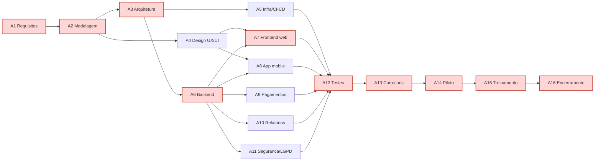

# Cronograma e Caminho Crítico — Projeto EstocaBem

**Aluno:** Rodolfo Miranda
**Disciplina:** Gestão de Projetos — IFMG / Sistemas de Informação

## 1. Contextualização do Projeto

O **EstocaBem** é um sistema **web + mobile** de gestão de estoque, vendas (PDV —
ponto de venda) e financeiro voltado para **micro e pequenas empresas do varejo**
(mercadinhos, papelarias, lojas de roupa, petshops e conveniências). Hoje, boa parte
desses comércios controla estoque e caixa em cadernos ou planilhas soltas, o que gera
rupturas de estoque, perdas por validade, erros de caixa e ausência total de
indicadores gerenciais.

O objetivo do projeto é substituir esses controles manuais por uma plataforma
integrada que:

- controla o estoque em tempo real (entradas, saídas, ajustes e estoque mínimo);
- registra vendas rápidas no balcão (PDV) com múltiplos meios de pagamento;
- gerencia o caixa e o financeiro (abertura/fechamento, sangria, contas a pagar/receber);
- oferece relatórios gerenciais (produtos mais vendidos, curva ABC, lucratividade);
- funciona **offline** no PDV, sincronizando quando a conexão voltar (requisito
  crítico para comércios com internet instável).

A empresa fictícia contratada montou a seguinte **equipe**:

- 1 gerente de projetos;
- 1 analista de requisitos;
- 1 arquiteto de software;
- 3 desenvolvedores full-stack;
- 1 desenvolvedor mobile;
- 1 analista de qualidade (QA);
- 1 designer UX/UI;
- 1 especialista DevOps.

O projeto está planejado para aproximadamente **3,5 meses** (73 dias úteis) e deverá
entregar: painel web administrativo, aplicativo mobile de PDV, módulo de estoque,
módulo financeiro/caixa, módulo de relatórios, integração com meios de pagamento
(Pix e cartão), infraestrutura em nuvem, além de documentação e treinamento.

O objetivo **deste trabalho** é aplicar a gestão do tempo: decompor o projeto em
atividades, identificar dependências, montar o cronograma (gráfico de Gantt) e
calcular o **caminho crítico**, observando gargalos e riscos de atraso.

---

## 2. Definição das Atividades do Projeto

A tabela abaixo apresenta a decomposição das principais atividades, com duração
estimada (em dias úteis), dependências e responsáveis.

| ID | Atividade | Duração | Dependência | Responsável |
|----|-----------|:-------:|-------------|-------------|
| A1 | Levantamento de requisitos com os lojistas | 6 | — | Analista de Requisitos |
| A2 | Modelagem dos processos de negócio (venda, estoque, caixa) | 4 | A1 | Analista de Requisitos |
| A3 | Definição da arquitetura (API, banco, cache, offline-first) | 6 | A2 | Arquiteto de Software |
| A4 | Design de UX/UI (web + mobile) | 8 | A2 | Designer UX/UI |
| A5 | Configuração da infraestrutura em nuvem e CI/CD | 4 | A3 | DevOps |
| A6 | Desenvolvimento do backend / API (auth, produtos, estoque, vendas, financeiro) | 20 | A3 | Desenvolvedores |
| A7 | Desenvolvimento do frontend web (painel de gestão) | 15 | A4, A6 | Desenvolvedores |
| A8 | Desenvolvimento do app mobile (PDV + modo offline) | 12 | A4, A6 | Dev Mobile |
| A9 | Integração com meios de pagamento (Pix / TEF / gateway) | 8 | A6 | Desenvolvedores |
| A10 | Módulo de relatórios e dashboard (curva ABC, lucratividade) | 7 | A6 | Desenvolvedores |
| A11 | Implementação de segurança e LGPD (criptografia, perfis, auditoria) | 6 | A6 | Devs + DevOps |
| A12 | Testes funcionais integrados | 8 | A5, A7, A8, A9, A10, A11 | Equipe de QA |
| A13 | Correção das falhas identificadas | 5 | A12 | Desenvolvedores |
| A14 | Implantação piloto em uma loja | 4 | A13 | Gerente de Projetos |
| A15 | Treinamento dos usuários | 3 | A14 | Gerente de Projetos |
| A16 | Encerramento do projeto e entrega final | 2 | A15 | Gerente de Projetos |

---

## 3. Explicação Detalhada das Atividades

**A1 – Levantamento de requisitos.** Entrevistas e observação nos balcões dos
lojistas para entender como vendem, controlam estoque e fecham o caixa. É a atividade
mais sensível: um erro aqui se propaga por todo o projeto (retrabalho).

**A2 – Modelagem de processos.** Documentação dos fluxos (venda no PDV, entrada de
mercadoria, fechamento de caixa, fiado/crediário), garantindo alinhamento entre a
operação real da loja e o sistema.

**A3 – Arquitetura.** Definição do banco de dados, da API, do cache (Redis), da
estratégia **offline-first** do PDV e dos padrões de segurança. Uma arquitetura mal
definida geraria gargalos graves de desempenho e problemas de sincronização.

**A4 – Design UX/UI.** Protótipos navegáveis do painel web e do app mobile. O PDV
precisa ser rápido e à prova de erro, porque será usado sob pressão no balcão.

**A5 – Infraestrutura em nuvem e CI/CD.** Provisionamento de servidores, banco
gerenciado, pipeline de build/deploy e ambientes de teste/produção.

**A6 – Backend / API.** Núcleo do sistema: autenticação e perfis, cadastro de
produtos, controle de estoque, motor de vendas, financeiro/caixa. Concentra a maior
parte do esforço e o maior número de dependências.

**A7 e A8 – Frontend web e app mobile.** Interfaces consumidas por donos, gerentes e
vendedores. O app mobile inclui o modo offline com fila de sincronização.

**A9, A10, A11 – Pagamentos, relatórios e segurança/LGPD.** Podem ser desenvolvidos
em paralelo após o backend, pois dependem apenas dele.

**A12 – Testes integrados.** Verificam funcionamento correto, segurança dos dados,
estabilidade, desempenho e a integração entre módulos (inclusive a sincronização
offline). Dependem da conclusão de praticamente tudo que é técnico.

**A13 a A16 – Correções, piloto, treinamento e encerramento.** Fecham o ciclo:
corrigir o que os testes apontaram, implantar em uma loja piloto, treinar os usuários
e encerrar formalmente com a entrega.

---

## 4. Cálculo do Caminho Crítico (CPM)

Para achar o caminho crítico, faço a **passagem para frente** (ES/EF — datas mais
cedo) e a **passagem para trás** (LS/LF — datas mais tarde) e calculo a **folga
total** de cada atividade: `Folga = LS − ES = LF − EF`. As atividades com folga zero
formam o caminho crítico.

> Convenção: os tempos abaixo estão em **dias** com base 0 (ES do projeto = 0).
> `EF = ES + Duração`. Na tabela de cronograma da Seção 6, converto para "Início =
> ES+1" apenas para leitura em dias corridos do calendário do projeto.

| ID | Dur | ES | EF | LS | LF | Folga | Crítica? |
|----|:---:|:--:|:--:|:--:|:--:|:-----:|:--------:|
| A1 | 6 | 0 | 6 | 0 | 6 | **0** | ✅ |
| A2 | 4 | 6 | 10 | 6 | 10 | **0** | ✅ |
| A3 | 6 | 10 | 16 | 10 | 16 | **0** | ✅ |
| A4 | 8 | 10 | 18 | 28 | 36 | 18 | — |
| A5 | 4 | 16 | 20 | 47 | 51 | 31 | — |
| A6 | 20 | 16 | 36 | 16 | 36 | **0** | ✅ |
| A7 | 15 | 36 | 51 | 36 | 51 | **0** | ✅ |
| A8 | 12 | 36 | 48 | 39 | 51 | 3 | — |
| A9 | 8 | 36 | 44 | 43 | 51 | 7 | — |
| A10 | 7 | 36 | 43 | 44 | 51 | 8 | — |
| A11 | 6 | 36 | 42 | 45 | 51 | 9 | — |
| A12 | 8 | 51 | 59 | 51 | 59 | **0** | ✅ |
| A13 | 5 | 59 | 64 | 59 | 64 | **0** | ✅ |
| A14 | 4 | 64 | 68 | 64 | 68 | **0** | ✅ |
| A15 | 3 | 68 | 71 | 68 | 71 | **0** | ✅ |
| A16 | 2 | 71 | 73 | 71 | 73 | **0** | ✅ |

### 4.1 Caminho Crítico Identificado

$$A1 \rightarrow A2 \rightarrow A3 \rightarrow A6 \rightarrow A7 \rightarrow A12 \rightarrow A13 \rightarrow A14 \rightarrow A15 \rightarrow A16$$

### 4.2 Duração Total do Caminho Crítico

$$6 + 4 + 6 + 20 + 15 + 8 + 5 + 4 + 3 + 2 = \mathbf{73\ dias\ úteis}$$

Portanto, o projeto tem duração mínima estimada de **73 dias úteis** (≈ 15 semanas /
≈ 3,5 meses). Qualquer atraso em uma atividade **crítica** (folga zero) empurra a
data final na mesma proporção. Já as atividades A4, A5, A8, A9, A10 e A11 possuem
folga e podem atrasar até o limite indicado sem afetar o prazo total — desde que uma
de cada vez e dentro da sua folga.

---

## 5. Identificação de Gargalos e Possíveis Atrasos

### 5.1 Gargalo 1 — Desenvolvimento do Backend (A6)
Com 20 dias e sendo pré-requisito de 5 atividades (A7, A8, A9, A10, A11), o backend
é o maior gargalo. Está no caminho crítico: qualquer atraso nele desloca praticamente
todo o restante técnico. Causas prováveis: requisitos mal definidos, modelagem de
estoque/financeiro mais complexa que o previsto, ou mudanças de escopo.

### 5.2 Gargalo 2 — Testes Integrados (A12)
Depende da conclusão de tudo (A5, A7–A11). Se qualquer frente atrasar, a homologação
inteira trava. Além disso, a sincronização offline do PDV é notoriamente difícil de
testar (conflitos de dados), o que pode estourar os 8 dias previstos.

### 5.3 Gargalo 3 — Integração com Meios de Pagamento (A9)
Embora tenha folga (7 dias), depende de terceiros: aprovação junto ao PSP/gateway,
homologação do Pix e certificação de TEF. Atrasos externos são imprevisíveis e podem
consumir toda a folga e virar crítica.

### 5.4 Risco de *Scope Creep*
Durante o desenvolvimento, os lojistas tendem a pedir funcionalidades novas, como:

- emissão de NFC-e / integração com a SEFAZ;
- programa de fidelidade e cupons de desconto;
- integração com e-commerce / marketplace;
- app de autoatendimento para o cliente;
- controle de múltiplas lojas com estoque centralizado.

Cada uma dessas ampliações mexe em cronograma, orçamento e complexidade técnica. Por
isso, qualquer alteração de escopo deve passar por **análise de impacto, aprovação
formal e replanejamento** (controle integrado de mudanças).

---

## 6. Gráfico de Gantt

Cronograma em dias úteis (Início = primeiro dia da atividade; Término = último dia).
As atividades **críticas** estão marcadas com ⭐.

| ID | Atividade | Dur | Início (dia) | Término (dia) | Crítica |
|----|-----------|:---:|:------------:|:-------------:|:-------:|
| A1 | Requisitos | 6 | 1 | 6 | ⭐ |
| A2 | Modelagem de processos | 4 | 7 | 10 | ⭐ |
| A3 | Arquitetura | 6 | 11 | 16 | ⭐ |
| A4 | Design UX/UI | 8 | 11 | 18 | |
| A5 | Infraestrutura + CI/CD | 4 | 17 | 20 | |
| A6 | Backend / API | 20 | 17 | 36 | ⭐ |
| A7 | Frontend web | 15 | 37 | 51 | ⭐ |
| A8 | App mobile (PDV) | 12 | 37 | 48 | |
| A9 | Meios de pagamento | 8 | 37 | 44 | |
| A10 | Relatórios / dashboard | 7 | 37 | 43 | |
| A11 | Segurança e LGPD | 6 | 37 | 42 | |
| A12 | Testes integrados | 8 | 52 | 59 | ⭐ |
| A13 | Correção de falhas | 5 | 60 | 64 | ⭐ |
| A14 | Implantação piloto | 4 | 65 | 68 | ⭐ |
| A15 | Treinamento | 3 | 69 | 71 | ⭐ |
| A16 | Encerramento | 2 | 72 | 73 | ⭐ |

### 6.1 Visualização (Gantt)

O diagrama abaixo (Mermaid) renderiza como gráfico de Gantt em editores compatíveis
(GitHub, VS Code com extensão Mermaid, etc.). As barras em vermelho (`crit`) são o
caminho crítico.

```mermaid
gantt
    title Cronograma do Projeto EstocaBem (dias úteis)
    dateFormat X
    axisFormat dia %s
    section Concepção
    A1 Requisitos            :crit, a1, 0, 6d
    A2 Modelagem processos   :crit, a2, after a1, 4d
    A3 Arquitetura           :crit, a3, after a2, 6d
    A4 Design UX/UI          :a4, after a2, 8d
    section Construção
    A5 Infra + CI/CD         :a5, after a3, 4d
    A6 Backend / API         :crit, a6, after a3, 20d
    A7 Frontend web          :crit, a7, after a6, 15d
    A8 App mobile (PDV)      :a8, after a6, 12d
    A9 Pagamentos            :a9, after a6, 8d
    A10 Relatorios           :a10, after a6, 7d
    A11 Seguranca/LGPD       :a11, after a6, 6d
    section Homologação e entrega
    A12 Testes integrados    :crit, a12, after a7, 8d
    A13 Correcao de falhas   :crit, a13, after a12, 5d
    A14 Implantacao piloto   :crit, a14, after a13, 4d
    A15 Treinamento          :crit, a15, after a14, 3d
    A16 Encerramento         :crit, a16, after a15, 2d
```

### 6.2 Diagrama de Rede (dependências e caminho crítico)

---

## 7. Conclusão

O EstocaBem tem duração mínima de **73 dias úteis**, determinada pelo caminho crítico
**A1 → A2 → A3 → A6 → A7 → A12 → A13 → A14 → A15 → A16**. O acompanhamento gerencial
deve priorizar essas atividades — em especial o **backend (A6)** e os **testes
integrados (A12)**, os dois maiores gargalos. As atividades com folga (design,
infraestrutura, mobile, pagamentos, relatórios e segurança) oferecem alguma margem de
manobra e são bons candidatos a **nivelamento de recursos**, mas exigem atenção à
integração com terceiros (pagamentos), cuja folga pode desaparecer diante de atrasos
externos. Por fim, um controle formal de mudanças é essencial para conter o
*scope creep* natural desse tipo de sistema de varejo.
